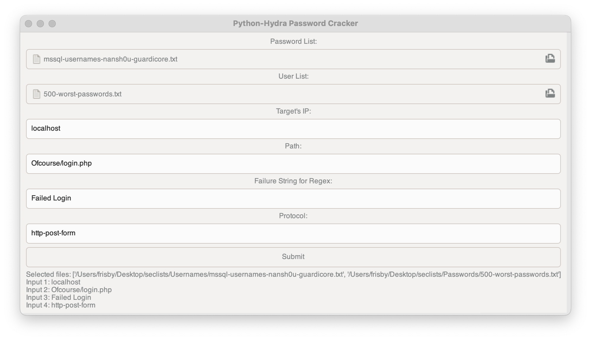

# pythonGTK-Form-Cracker
Just experimenting with a Python GTK GUI, that's going to take in a few paramaters and then either run hydra or nmap to crack forms displaying the output in my GTK GUI. The GUI is going to handle everything, just need to input a few values.

# To-DO
- Test out some hydra usage, and nmap usage via subprocess
- Add a few input areas for values needed to crack forms
- Figure out how to style GTK apps
- Figure out how to size, scale, and just generally develope GTK apps, as this is my first time

This is just my start. 2 days in with this build, so be nice.

